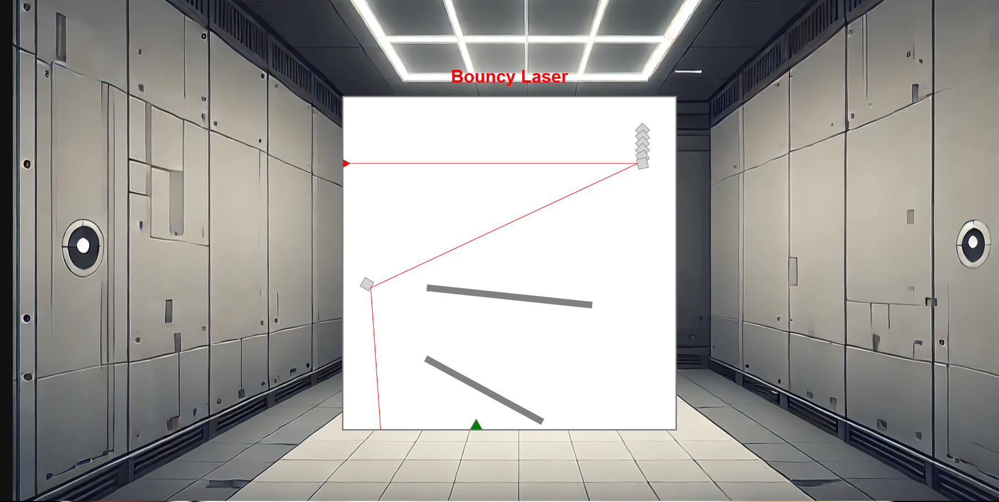
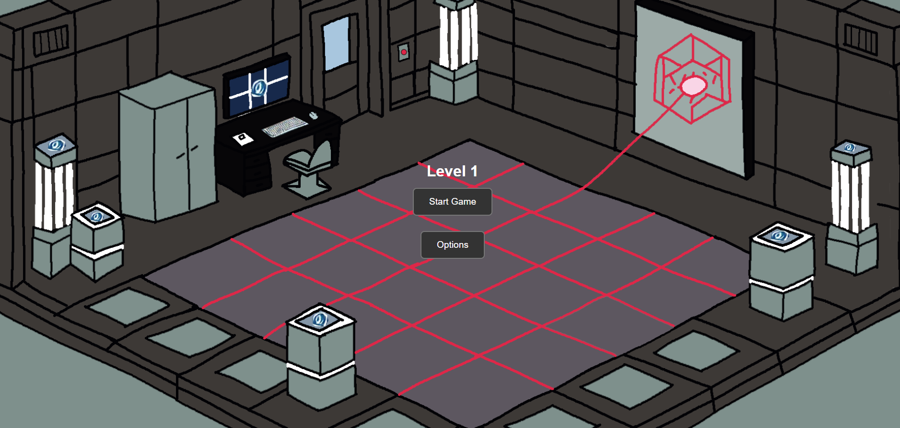

# 🎮 **Bouncy Laser** 

> **Play a laser reflecting game and with the help of your own knowledge of physics win the game.**

---

## 🌐 **Play the Game**
[Click here to play the game!](https://your-github-username.github.io/repository-name)

---

## 📸 **Screenshots**

### Main Gameplay:

  
  
*Figure 1: Example of gameplay in action.*

---

### Menu and UI:

  
  
*Figure 2: Menu and user interface.*

---

## ✍️ **Reflection**

### What went well:
- **Creative Design:** I tried  to make something different and challenging and it went quite well
- **Core Mechanics:** The Laser reflects very well and realistic, the physics of the mirrors is perfect and I learned something new.

### Challenges:
- **Aspirations vs Reality:** I had bigger asiprations from me and I wantd to do more but I didn t have enough time and resources.
- **Bug Fixes:** Handling  the mirrors and makeing them work was a bit tricky.

### Lessons Learned:
- **Time Management:** Managing time and I have to learn to plan my steps better.
- **Keep it Simple:** Next time I will try to keep things more simple and easier for me understand.
